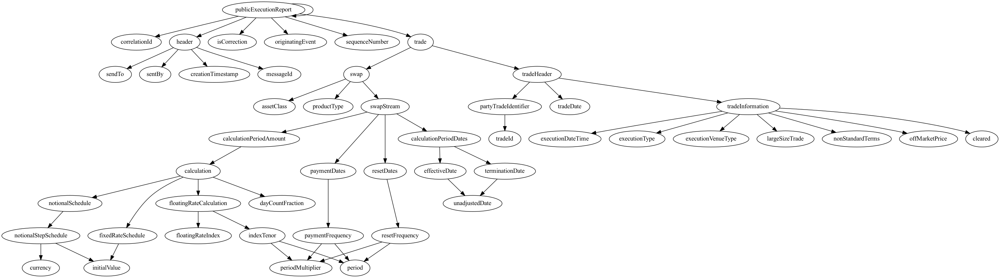

# xml2flow - simplify xml flow by converting xml files to flowcharts

xml2flow is an intitiative I have started to attract more development in the xml space. Most xml development is ancient to say the least and seriously needs the magic touch of open source. This could have very well been a simple post on some remote forum, but it is sad to say that xml as a tool is dying (yet it is essential to our banking systems). By starting this initiative, I would like to initiate a new era of rejuvination of xml as an important tool.

## Website
 [xml2flow website](https://raanaji.github.io/xml2flow/)

## Credits
*   [XMLSarlet](https://www.wikiwand.com/en/XMLStarlet)

## License
Use it freely and please contribute
